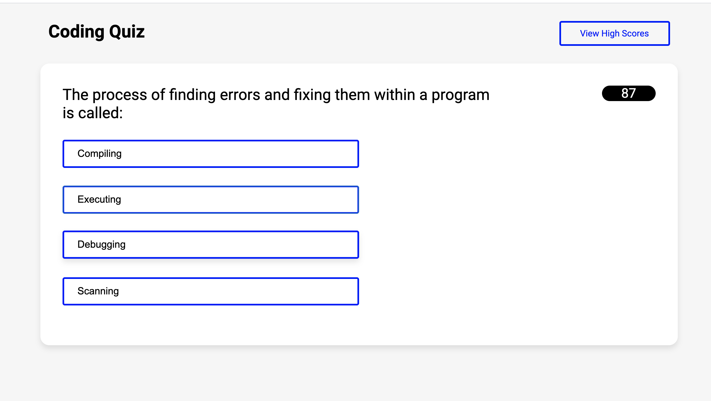

# Multiple Choice Coding Quiz

## A multiple choice quiz using JavaScript, HTML and CSS.

## Quiz Features:
- 2 minute timer
- instant feedback on answer click
- +10 points for correct answers
- -10 seconds for incorrect answers
- saved high score (pending)

## Deployed Application
https://flokamp.github.io/code-quiz/index.html

